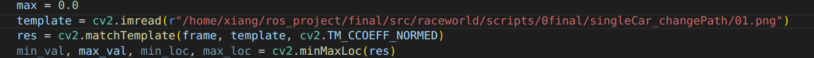

# raceworld

<mark>建议多多测试、多多测试、多多测试，检测各个功能是否达到比赛要求！！！</mark>

## 简介
本程序基于2022年上海市电赛题目设计，其中涉及到apriltag识别，智能车巡线与变道，多车跟随以及stop sign识别（OCR）等多方面全功能的自动驾驶设计，具有轻量化特点。

## 文件架构
1. urdf：gazebo仿真组件
2. world：gazebo仿真世界
3. scripts：核心运行脚本
    1. 0final：最终赛题实现文件
4. launch：launch控制文件

## 使用方法
### 变道任务1
1. 启动环境：`roslaunch raceworld raceworld1.launch`
2. 关闭阴影
3. 修改模板地址为本地地址

4. 启动脚本：`rosrun raceworld running_car.py`
   
### 变道任务2
1. 启动环境：`roslaunch raceworld raceworld2.launch`
2. 关闭阴影
3. 修改模板地址为本地地址

4. 启动脚本：`rosrun raceworld running_car2.py`

### 提高赛题-多车跟随
1. 启动环境：`roslaunch raceworld multicars.launch`
2. 关闭阴影
3. 启动脚本：`roslaunch raceworld multi_follow2.launch`
   
   
## 功能及使用方法

### 查看摄像头图像
1. 启动环境：`roslaunch raceworld (any file).launch`
2. 启动脚本：`rosrun raceworld get_camera.py`

### 键盘控制及车辆巡线
1. 启动环境：`roslaunch raceworld (any file).launch`
2. 键盘控制：`rosrun raceworld key_op.py`，控制方法为w-a-s-d方式，x小车停止运动，o退出键盘控制。
3. 巡线1：`rosrun raceworld follow.py`，控制方式为识别黄线，对黄线的位置做平移操作得到前进方向，速度慢，稳定性低。
4. 巡线2：`rosrun raceworld follow2.py`，优化了巡线1，更快更稳！！！

### tag识别
1. 启动环境:`roslaunch raceworld (any file).launch`
2. tag识别：`rosrun raceworld tag_detect.py`

### 变道任务
#### 变道1
1. 启动环境：`roslaunch raceworld raceworld1.launch`
2. 任务脚本：`rosrun raceworld change_path1.py`
#### 变道2
1. 启动环境：`roslaunch raceworld raceworld2.launch`
2. 任务脚本：`rosrun raceworld change_path2.py`

### 多车跟随
#### 多车跟随1
1. 启动环境：`roslaunch raceworld multicars.launch`
2. 运行脚本：`roslaunch raceworld multi_follow1.launch`
#### 多车跟随2
&emsp;自己写的方法,不如另外一组的稳定.
1. 启动环境：`roslaunch raceworld multicars.launch`
2. 运行脚本：`roslaunch raceworld multi_follow2.launch`

### stop sign 识别
1. 启动环境：
2. 运行脚本：

### 复合任务
1. 启动环境:
2. 运行脚本:
