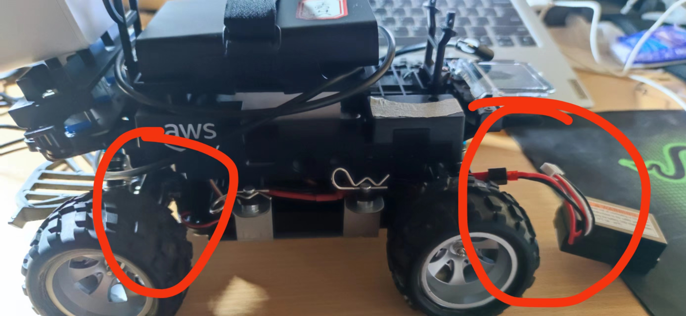
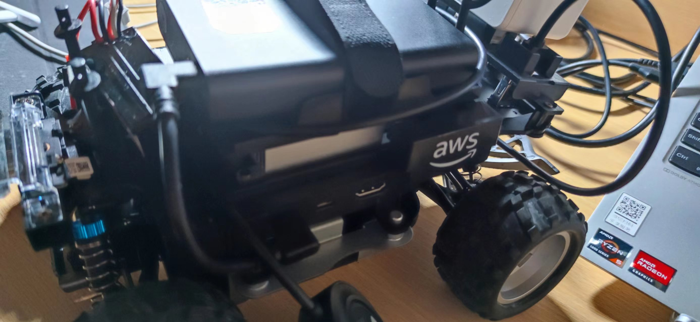
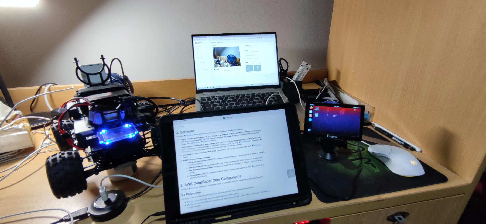

# 调车记录
&emsp;参考链接：
1. https://docs.aws.amazon.com/zh_cn/deepracer/latest/developerguide/deepracer-set-up-vehicle.html
2. https://wiki.ros.org/aws_deepracer
3. 也可以参考以下昨天的培训记录
## 车辆模块
1. 驱动模块
&emsp;将插销拔掉后的下半部分
2. 计算模块
&emsp;插销拔掉后的下半部分

&emsp;***注意：抬起上半部分的时候不要太用力，防止扯断线路***

## 车辆启动
1. 启动驱动模块
   将电池连接到车辆的驱动模块，波动位于**左前轮附近**的驱动模块开关，听到**哔哔声**即可。
   
2. 启动计算模块
   1. 连接电源（**接口在右侧**）后按下车辆**左侧**的电源按钮，等车位**蓝灯**亮起即为启动成功。
   2. 如果不使用电源可使用计算电池(如图)，先按下计算电池上电源，然后步骤与上述一致。
   
   3. 连接键盘鼠标显示器
   将键盘和鼠标连在**拓展坞上**即可，显示器通电后用**HDMI**线与车辆连接，即可登入小车自带的ubuntu系统（20.04，Ros2），**密码：deepracer1**
3. 连接wifi进入控制台
   将小车的ubuntu和电脑接入同一wifi（**建议手机热点**），用小车系统访问**deepracer.aws，忽略安全问题继续访问，密码Geey5tLz，在页面中找到小车的ip，在你的电脑上访问该ip输入密码即可登入控制台,此时可以远程控制小车**（不过除了让小车动一下好像没啥用，下车前进动力很不足，后退可以），**暂时不用校准车辆**
   
4. 研究以下怎么利用ros2驱动小车运动，具体可以参考上面的链接，或者比较一下ros1和2看看要不要卸掉2重装1？（不确定）
